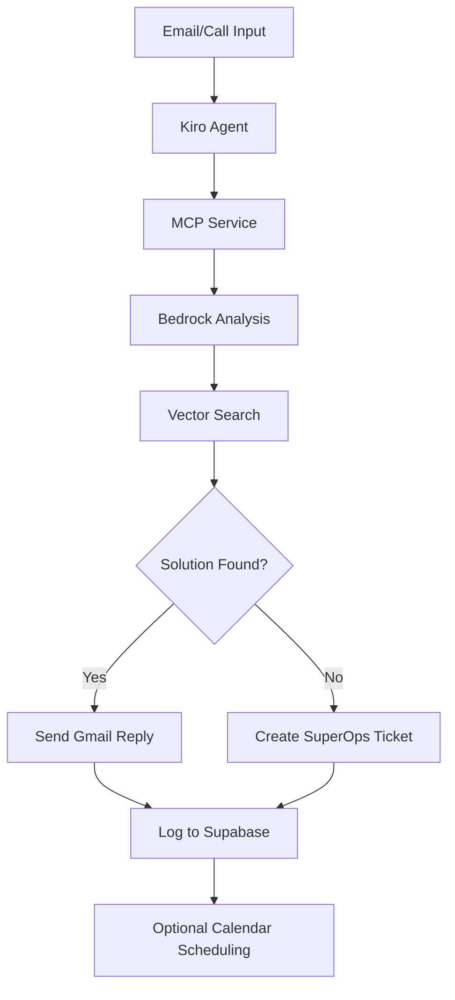

# SuperTickets.AI - System Structure

## Overview
This document defines the technical architecture and component structure for SuperTickets.AI, an AI-powered support triage system.

## System Components

### 1. Kiro Agents Layer
- **Email Agent**: Processes incoming support emails
- **Call Agent**: Handles call transcription analysis
- **Coordination**: Agents communicate via MCP protocol

### 2. FastAPI MCP Microservice
- **Core Service**: FastAPI application serving MCP endpoints
- **Route Handlers**: Specialized endpoints for each operation
- **Utility Layer**: Shared services for external API integration

### 3. External Integrations
- **AWS Bedrock**: AI model inference (GPT-4o-mini)
- **Supabase**: Vector database and memory storage
- **Gmail API**: Email sending and receiving
- **SuperOps API**: Ticket creation and management
- **Google Calendar**: Meeting scheduling

## Data Flow

## Component Responsibilities

### Email Agent (`email_agent.yaml`)
- Monitor email inbox
- Extract issue content
- Trigger MCP analysis workflow
- Handle response delivery

### Call Agent (`call_agent.yaml`)
- Process call transcriptions
- Extract key issue points
- Route to appropriate MCP endpoints
- Manage follow-up actions

### MCP Service Routes
- `kb_lookup.py`: Knowledge base vector search
- `create_ticket.py`: SuperOps ticket creation
- `send_email.py`: Gmail response handling
- `log_memory.py`: Supabase interaction logging
- `schedule_meeting.py`: Google Calendar integration

### Utility Services
- `superops_api.py`: GraphQL client for SuperOps
- `gmail_client.py`: Gmail API wrapper
- `supabase_client.py`: Database and vector operations
- `google_calendar.py`: Calendar API integration
- `embedding_search.py`: Vector similarity search

## Configuration Management

### Environment Variables
- AWS credentials and region
- Supabase connection details
- Google API credentials
- SuperOps API configuration

### MCP Configuration
- Service endpoints mapping
- Authentication settings
- Timeout and retry policies

## Error Handling Strategy

### Graceful Degradation
- Fallback to manual ticket creation if AI fails
- Email notification for system errors
- Retry mechanisms for API failures

### Logging and Monitoring
- Structured logging for all operations
- Performance metrics collection
- Error tracking and alerting

## Security Considerations

### API Security
- OAuth 2.0 for Google services
- API key rotation policies
- Encrypted credential storage

### Data Privacy
- PII handling compliance
- Secure vector embeddings
- Audit trail maintenance